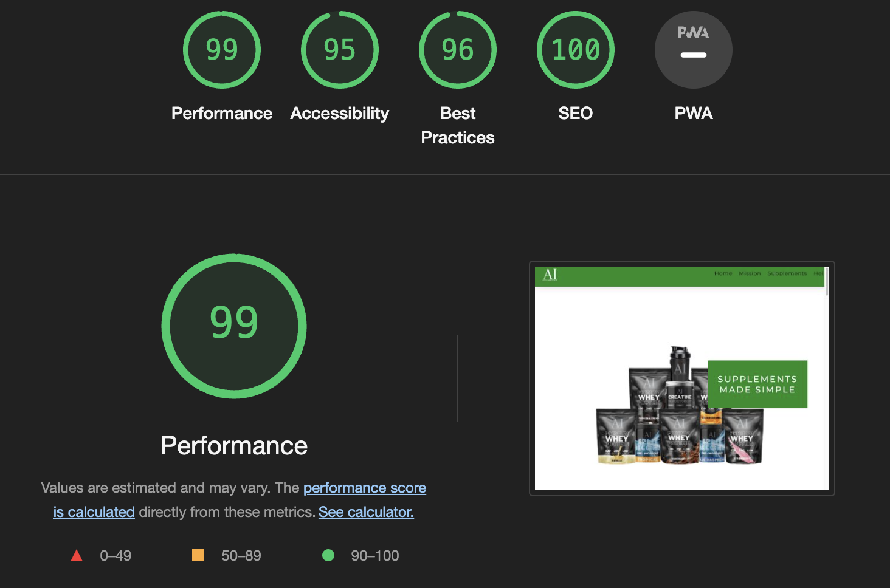

# Active Improvement

Active Improvement is real company. It sells high quality but simple gym supplements to gym users. The supplements can be taken by complete novices or by experienced athletes. The site's aim is to explain the benefits of each of its supplements in simple terms so that people understand what they are buying.

Active includes instructions on when, why and how to use each product to help boost somebody's training and "Actively Improve" their all round fitness, health & wellness.

The live link to the site can be found here - [Active Improvement](https://chrismurph12.github.io/active-improvement/)

## Site Owner Goals
- Stress the importance of not spending too much money on pointless supplements that won't do anything to help the user.
- Identify the supplemets that can make a difference, and then break each one down to explain what they are, and their benefits.
- Keep the website simple. If the website is too complex, it negates the message of simplicity that the owner is trying to put forward.
- Encourage users to ask questions to get accurate advice.

## User Stories
- ### First Time User
  - As a first time user I want to gain some knowledge of how to save some money when buying supplements.
  - As a first time user I want to understand which products would help me achieve my goals.
  - As a first time user I want to understand WHY these chosen products would help me more than others

### Returning User
  - As a returning user I want to ask some more questions that will help mem on my journey.
  - As a returning user I want to find out how I can purchase these products.

## Design

### Imagery
The imagery used is extremely simplistic which is important to the user experience. We want them to not be overwhelmed by lots of pictures. WE keep it simple and only have 4 pictures on the site. The hero image, which is a selection of all of our products. A protein image, a pre-workout image, and a creatine image.

### Colours
The colour scheme is white and green. People associate green with healthy, so this seemed like the obvious choice of colour. The white then keeps the site looking simple and clean, allowing the font to be easily readable.

### Fonts
The Montserrat font is the main font used throughout the whole website. This font was imported via [Google Fonts](https://fonts.google.com/). I'm using Sans Serif as a backup font, in case for any reason the main font isn't being imported into the site correctly.

## Wireframes
Wireframes were produced using Balsamiq. 

 

 
Desktop Wireframe

 
 
 

 

    
Mobile Wireframe

 

## Features
- ### Navigation

    - The navigation bar links to each section of the page. People can click on Home, Mission, Supplements, and Help.
    - The Supplements option has a drop down link to each supplement on the page for people to click through to the specific supplement they want more information on.
    - The bar is fixed so that it is visible at all times for easy navigation for the user.
    - [Navigation Bar](assets/images/navigation.png)
 
- ### Hero Image

    - The Hero Image includes a main image of all available supplements and some wording for people to immediately understand what the site is about.
    - [Hero Image](assets/images/hero-image.png)

- ### Our Mission Section

    - The Our Mission section shows users what we're all about. It clearly outlines our mission of manufacturing the best quality products that help with overall fitness, health & wellness.
    - It also explains WHY we have that goal, which is extremely important to include as we want to stress the importance of keeping things as simple as possible.
    - [Our Mission Section](assets/images/mission.png)
 
- ### Supplements Section
    - This section provides a more in-depth look of each supplement that we offer; protein, pre workout and creatine.
    - Each product has an initial bio of what the product is, followed by how we have made the product, finishing with 4/5 key benefits of that product.
    - [Supplements Section](assets/images/products.png)

- ### Help & Advice Section
    - The Help & Advice section is designed for people who have any questions around health, fitness & wellness.
    - We don't want to be limited by the information we have on the page. Everybody has individual needs and we want to be accessible to people who have specific questions.
    - [Help & Advice Section](assets/images/help-section.png)
 
- ### Footer
    - The footer has 2 links. It links to our Instagram page and our Youtube page.
    - The links open in a new tab as to not disturb the user experience on our website.
    - [Footer](assets/images/footer.png)

### Validator Testing
- #### HTML
    - No errors were returned when passing through the official W3C Markup Validator
    -   - [W3C Validator Results](https://validator.w3.org/nu/?doc=https%3A%2F%2Fchrismurph12.github.io%2Factive-improvement%2F)
- #### CSS
    - No errors were returned when passing through the official W3C CSS Validator
    -   - [CSS Validator Resuls](https://jigsaw.w3.org/css-validator/validator?uri=https%3A%2F%2Fchrismurph12.github.io%2Factive-improvement%2F&profile=css3svg&usermedium=all&warning=1&vextwarning=&lang=en)

### Form Testing
- The form has been tested to ensure it would not submit without the required input fields being filled in.

### Links Testing
- All links were tested manually to ensure the user is directed to the corresponding section of the website.
- Social Media links in the footer of each page were tested manually to ensure they direct the user to the correct page and open in a new tab. 

### Browser Testing
- The Website was tested on Google Chrome, Firefox, Microsoft Edge, Safari browsers with no issues noted.

### Device Testing
- The website was viewed on a variety of devices such as Desktop, Laptop, iPhone 8, iPhoneX and iPad to ensure responsiveness on various screen sizes. The website performed as intended. The responsive design was also checked using Chrome developer tools across multiple devices with structural integrity holding for the various sizes.
- I also used the following website to test responsiveness:
- [Am I Responsive](https://ui.dev/amiresponsive?url=https://chrismurph12.github.io/active-improvement/)

### Accessibility 
    - The site achieved a Lighthouse score of 99%.

### Known Bugs
The social media icons don't show up for some reason. They work, but their corresponding logo doesn't appear. It's just a square box in its place.

## Technologies Used

### Languages
- HTML5
- CSS

### Frameworks - Libraries - Programs Used
- [Am I Responsive](http://ami.responsivedesign.is/) - Used to verify responsiveness of website on different devices.
- [Balsamiq](https://balsamiq.com/) - Used to generate Wireframe images.
- [Font Awesome](https://fontawesome.com/) - Used for Social Media icons in footer.
- [GitHub](https://github.com/) - Used for version control and hosting.
- [Google Fonts](https://fonts.google.com/) - Used to import and alter fonts on the page.
- [TinyPNG](https://tinypng.com/) - Used to compress images to reduce file size without a reduction in quality.
- [W3C](https://www.w3.org/) - Used for HTML & CSS Validation.

## Deployment

The project was deployed using GitHub pages. The steps to deploy using GitHub pages are:

1. Go to the repository on GitHub.com
2. Select 'Settings' near the top of the page.
3. Select 'Pages' from the menu bar on the left of the page.
4. Under 'Source' select the 'Branch' dropdown menu and select the main branch.
5. Once selected, click the 'Save'.
6. Deployment should be confirmed by a message on a green background saying "Your site is published at" followed by the web address.

## Credits

### Content
As a Personal Trainer and supplement specialist, all content was created personally, with no outside research.

### Media
All images were created by myself for my company. The images were created on Canva. The company website can be found here to see the images that have been used. [Active Improvement Website](https://activeimprovement.co.uk/)

### Resources Used

- Inspiration for dropdown nav bar - [W3Schools](https://www.w3schools.com/)
- [Stack Overflow](https://stackoverflow.com/)

## Acknowledgments
My mentor Antonio for his support and advice.
Former Student Ali OKeefe (provided by my mentor) for inspiration on site layout and css structure.

The Code Institute slack community for their quick responses and very helpful feedback!
